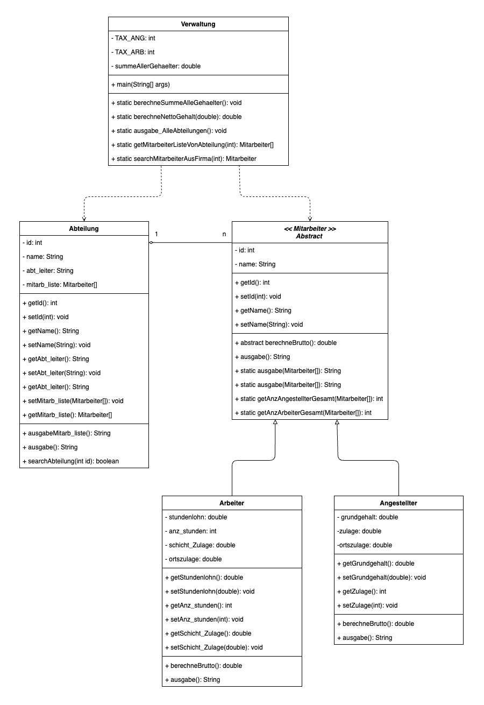

# Firma Version 3
Dieses Repo enthält die Java-Lösung zum dritten Teil des Projekts "Firma".

Zum Starten, bitte `Verwaltung.java` ausführen und auf die Console achten.

Die Dateien `MitarbeiterTest.java` und `VerwaltungTest.java` enthalten insgesamt acht JUnit-Tests.

## Klassendiagramm

Die Originaldateien des Klassendiagramms findet man hier: https://github.com/mbalabanov/ClassDiagramFirmaV3
